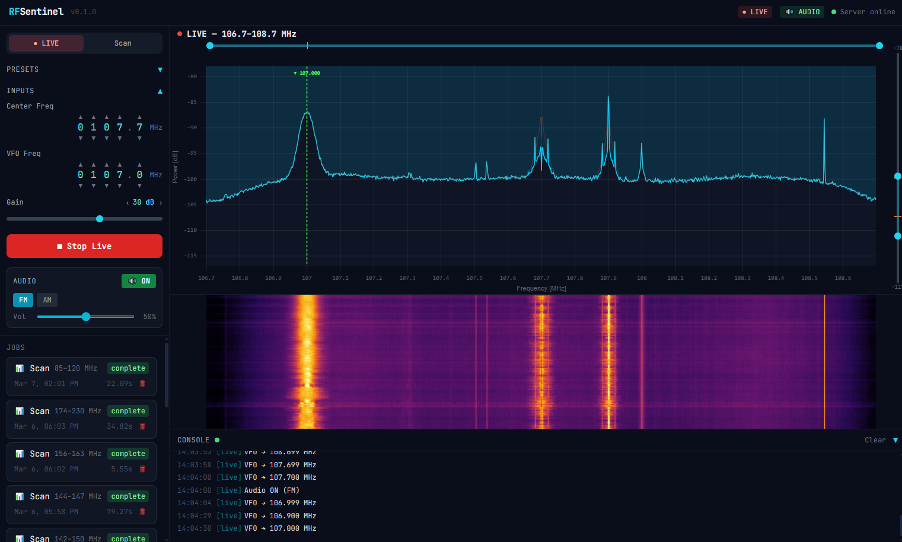
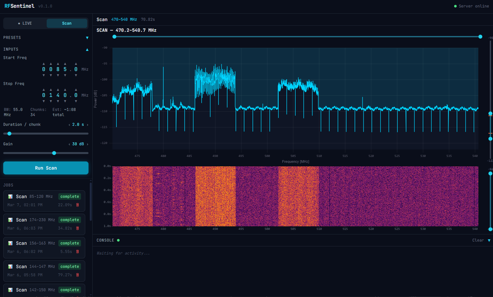

# RFSentinel

**Open-source RF spectrum monitoring platform**

Multi-SDR tool for real-time RF spectrum analysis with live audio demodulation. Supports **RTL-SDR** and **HackRF One** devices, including multiple devices simultaneously.




## Quick Start

```bash
# Install Python dependencies
pip install -r requirements.txt

# Start the backend (SDR required)
python -m core.api.server

# In a second terminal, start the frontend
cd frontend
npm install
npm run dev

# Open http://localhost:5173
```

## Requirements

- **Hardware:** RTL-SDR Blog V4 (or compatible) and/or HackRF One
- **OS:** Windows 10/11, Linux
- **Python:** 3.10+
- **Node.js:** 18+ (for frontend)

> **Windows note:** HackRF DLLs (`hackrf.dll`, `libusb-1.0.dll`, `pthreadVC2.dll`) are bundled in `core/sdr/libs/` and loaded automatically — no separate driver install needed.

## Features

### Supported Hardware

| Device | Frequency Range | Gain | Library |
|--------|----------------|------|---------|
| RTL-SDR | 24 – 1766 MHz | 0 – 50 dB | pyrtlsdr |
| HackRF One | 1 – 6000 MHz | 0 – 50 dB (LNA+VGA mapped) | pyhackrf2 |

- **Multi-device support** — connect multiple RTL-SDR and/or HackRF devices at the same time. The device selector dynamically enumerates all connected hardware with serial numbers.
- **Custom device names** — assign persistent aliases to devices (stored in SQLite by serial). Useful for identifying antennas, e.g. "L-Band (Bias-T)" or "HF Antenna".
- **Bias-T control** — toggle bias-T power from the UI for devices that support it.

### Live Mode

Continuous real-time spectrum display:

- Live-updating power spectrum with scrolling waterfall spectrogram
- Max-hold trace (decaying peak envelope)
- Temporal PSD smoothing (EMA) for stable display and better weak-signal visibility
- Click-to-tune VFO marker with draggable repositioning
- FM/AM audio demodulation streamed as PCM over WebSocket
- Drag-to-pan and scroll-to-zoom on the frequency axis
- Dual-thumb range sliders for both axes

### Scan Mode

Captures a spectrum + waterfall over a frequency range, stitching multiple chunks for wide sweeps (>1.6 MHz bandwidth per chunk, 80% usable with edge trimming). Full-resolution 1D spectrum with decimated 2D waterfall for web delivery. Scan history persisted in SQLite — browse, re-view, or delete past scans. Running scans can be cancelled.

### Frontend

- uPlot-based spectrum chart with real-time updates
- Waterfall spectrogram with contrast slider
- Preset buttons for common bands (FM, airband, ham, ISM)
- Dynamic device selector with refresh and rename controls
- Scan history panel — browse past scans, view results, delete entries
- Settings panel: colors, markers, display font sizes (persisted in SQLite)
- Real-time log console and job history via WebSocket

## API

| Endpoint | Method | Description |
|----------|--------|-------------|
| `/api/devices` | GET | Enumerate connected SDR devices |
| `/api/devices/alias` | POST | Set or delete a device alias |
| `/api/scan` | POST | Submit a scan job |
| `/api/live/start` | POST | Start live streaming |
| `/api/live/stop` | POST | Stop live streaming |
| `/api/settings` | GET/POST | Read/write application settings |
| `/api/frequencies` | GET/POST | Saved frequencies CRUD |

## License

MIT
